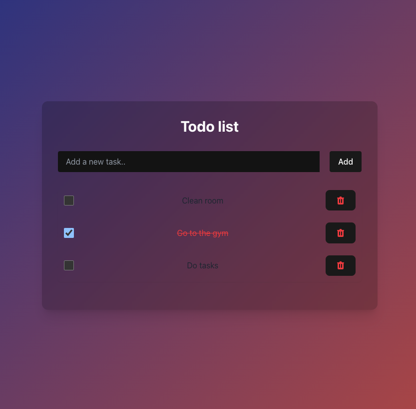

# Todo List App

A simple, elegant task management application built with React, TypeScript and Tailwind CSS.

## Features

- Create and delete tasks
- Mark tasks as completed
- Persistent storage using localStorage
- Responsive design
- Clean, modern UI with gradient background

## Technologies Used

- React 19
- TypeScript
- Tailwind CSS

## Getting Started

### Prerequisites

- Node.js (v14 or later)
- npm or yarn

### Installation

1. Clone the repository:
 git clone https://github.com/Pacholekk/todo-list-app.git
2. Navigate to the project directory:
 cd todo-list-app
3. Install dependencies:
 npm install

todo-list-app/
├── public/
├── src/
│   ├── components/      # React components
│   │   ├── TodoForm.tsx # Form for adding new tasks
│   │   ├── TodoItem.tsx # Component for individual tasks
│   │   └── TodoList.tsx # Component displaying list of tasks
│   ├── types/           # TypeScript definitions
│   │   └── todo.ts      # Types related to todo items
│   ├── App.tsx          # Main component
│   ├── index.tsx        # Entry point
│   └── index.css        # Styles including Tailwind
└── package.json

## Future Enhancements

- Task editing
- Due dates
- Categories/tags for tasks
- Dark/light theme toggle
- Drag and drop reordering

## License

[MIT](LICENSE)

## Contact

Patryk Pacholski- [GitHub](https://github.com/Pacholekk
